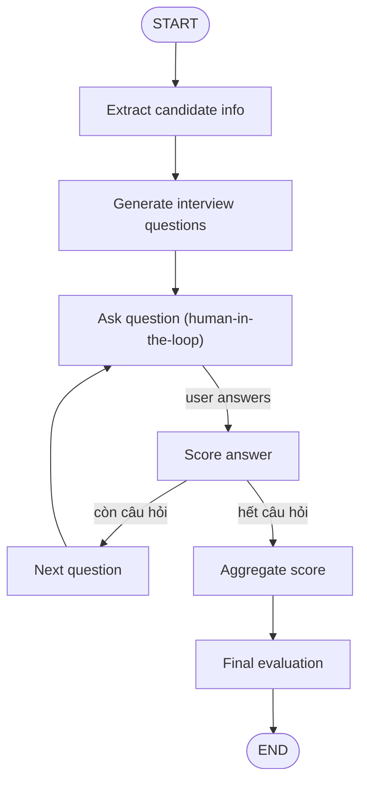

### Bài tập: Agent Phỏng vấn Nhân sự (AI Interviewer)

### Mục tiêu

Xây dựng một **Agent phỏng vấn** với LangGraph có khả năng:

- **Trích xuất thông tin ứng viên** từ CV (CV → thông tin có cấu trúc).
- **Sinh danh sách câu hỏi** phù hợp với từng ứng viên.
- **Phỏng vấn nhiều vòng** (Q&A): hỏi từng câu, chờ ứng viên trả lời (Human-in-the-loop).
- **Chấm điểm từng câu** và lưu kết quả.
- **Tổng hợp điểm + nhận xét cuối** (Aggregate Score, Final Evaluation).

Mã nguồn đã được scaffold sẵn với rất nhiều **TODO**. Nhiệm vụ của bạn là **tự implement** theo hướng dẫn trong `FUNCTIONS.md` và các comment TODO trong từng file.

### Luồng tổng thể (Agent Flow)



### Các Node chính

- **Trích xuất thông tin ứng viên** (`nodes/extract_candidate_info.py`):
  - Đọc CV (text), trích xuất một lần thành state **candidate_info**.
- **Generate Interview Questions** (`nodes/generate_questions.py`):
  - Sinh danh sách câu hỏi (id, skill, question, max_score) dựa trên `candidate_info`.
- **Ask Question (Human-in-the-loop)** (`nodes/ask_question.py`):
  - Đưa câu hỏi hiện tại vào `messages` (role `"assistant"`), là điểm **interrupt**
    để UI hiển thị câu hỏi và chờ người dùng trả lời.
- **Score Answer** (`nodes/score_answer.py`):
  - Chấm câu trả lời (score, comment), append vào `scores`.
- **Next Question** (`nodes/next_question.py`):
  - Tăng `current_question_index`, reset `candidate_answer`.
- **Aggregate Score** (`nodes/aggregate_score.py`):
  - Tính `total_score`, `max_score`, `percentage`.
- **Final Evaluation** (`nodes/final_evaluation.py`):
  - Đánh giá cuối: level (Pass/Consider/Reject), summary.
- **Routing** (`nodes/routing_edges.py`):
  - Các hàm route_* quyết định nhánh tiếp theo dựa trên `state` (error, còn câu hỏi, v.v.).

### State (InterviewState)

Định nghĩa chi tiết trong `state.py`, gồm:

- `cv_text`, `candidate_info`
- `questions`, `current_question_index`
- `candidate_answer`, `scores`, `messages`
- `total_score`, `max_score`, `percentage`
- `final_result`, `error`, `error_message`

### Cấu trúc thư mục (cập nhật)

```text
practices/
├── README.md
├── FUNCTIONS.md
├── main.py
├── agent.py
├── node_define.py
├── state.py
├── data/
│   └── sample_cv.txt
├── nodes/
│   ├── __init__.py
│   ├── extract_candidate_info.py
│   ├── generate_questions.py
│   ├── ask_question.py
│   ├── score_answer.py
│   ├── next_question.py
│   ├── aggregate_score.py
│   ├── final_evaluation.py
│   └── routing_edges.py
└── prompt/
    ├── __init__.py
    ├── extract_candidate_info_prompt.py
    ├── generate_questions_prompt.py
    ├── score_answer_prompt.py
    └── final_evaluation_prompt.py
```

### Config

- Dùng config từ `lecture_4`,  `from config import settings` (LLM_API_KEY, LLM_BASE_URL, LLM_CHAT_MODEL).

### Human-in-the-loop — setup ở đâu

Human-in-the-loop (đợi người dùng trả lời rồi mới chạy tiếp) cần setup **2 chỗ**:

- **`agent.py`** — Khi compile graph:
  - Dùng `interrupt_after=[GraphNode.ASK_QUESTION.value]` khi gọi `graph.compile(...)` để graph **dừng tại điểm hỏi câu hỏi**.
  - Kết hợp với checkpointer in-memory (`MemorySaver`) để lưu state theo `thread_id`.

- **`main.py`** — Vòng lặp chạy phỏng vấn (Gradio):
  - Lần đầu: invoke graph với `{"cv_text": ...}` và `config = {"configurable": {"thread_id": ...}}`.
  - Khi graph **bị interrupt**:
    - Lấy `state` trả về, lấy câu hỏi hiện tại (từ `messages` hoặc `questions`).
    - Hiển thị cho người dùng, nhận `candidate_answer`.
    - Gọi lại graph (resume) với state đã thêm `candidate_answer` và **cùng `thread_id`**.
  - Khi `final_result` có trong state: hiển thị kết quả và kết thúc phiên.
  - Quy tắc: khi đang interrupt trong một `thread_id`, **không cho phép đổi CV mới**; nếu muốn CV khác thì tạo thread/session mới.

### Cách làm bài

- Đọc `FUNCTIONS.md` để biết từng function/node cần implement.
- Hoàn thiện TODO trong:
  - Thư mục `prompt/` (các prompt cụ thể).
  - Thư mục `nodes/` (logic gọi LLM, routing, tính điểm).
  - File `agent.py` (build graph, checkpointer, interrupt_after).
  - File `main.py` (Gradio UI, upload PDF/TXT, interrupt/resume).
- Chạy `main.py`, upload CV (txt hoặc pdf), trả lời lần lượt các câu hỏi và xem `final_result`.

### Tham khảo

- **LangGraph**: `lecture_4/main.ipynb` (StateGraph, nodes, conditional_edges, interrupt).
- **State & multi-turn**: Bài toán CSKH hoàn tiền trong notebook (extract, generate_question, loop).
